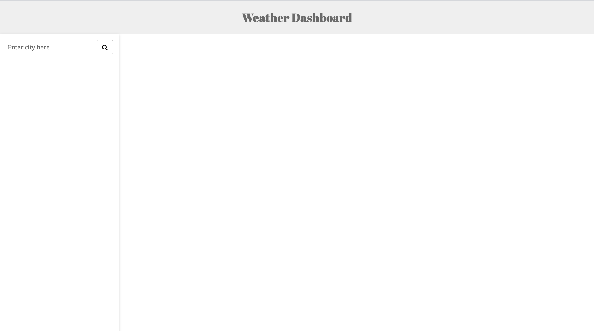
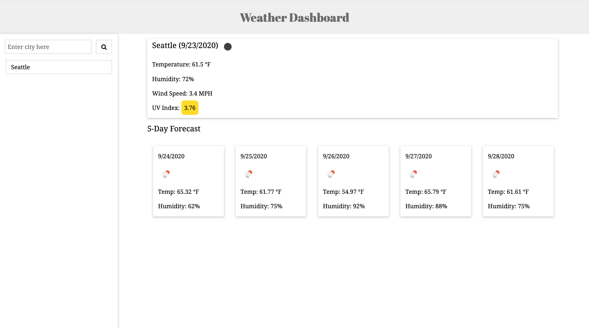

# Weather Dashboard

## Requirements

Build a weather dashboard that will run in the browser and feature dynamically updated HTML and CSS. Use the [OpenWeather API](https://openweathermap.org/api) to retrieve weather data for cities. Use `localStorage` to store any persistent data.

* Weather dashboard must have form inputs

* When user searches for a city, the current and future conditions for that city are displayed and that city is added to the search history

* Current weather conditions consist of city name, current date, an icon representation of weather conditions, current temperature, current humidity, current wind speed, and UV index

    * UV Index Color Coding

        * Low: UVI < 2  UVI

        * Moderate: 2 <= UVI < 5  UVI

        * High: 5 <= UVI < 7  UVI

        * Very High: 7 <= UVI <10  UVI

        * Extreme: UVI >= 10  UVI

* Future weather conditions consist of 5-day forecast that displays date, an icon representation of weather conditions, temperature, and humidity

* When user clicks on a city in the search history, current and future conditions for that city will be displayed

* When opening the weather dashboard, the last searched city current weather and forecast

## Website Walk-Through

* On loading

  

* Display weather

  

## Files

* `index.html`

* `script.js`

* `style.css`

* `after_loading.png`

* `display_weather.png`

* `README.md`

## Deployed Link
https://zhouyiartemiswang.github.io/weather_dashboard/
